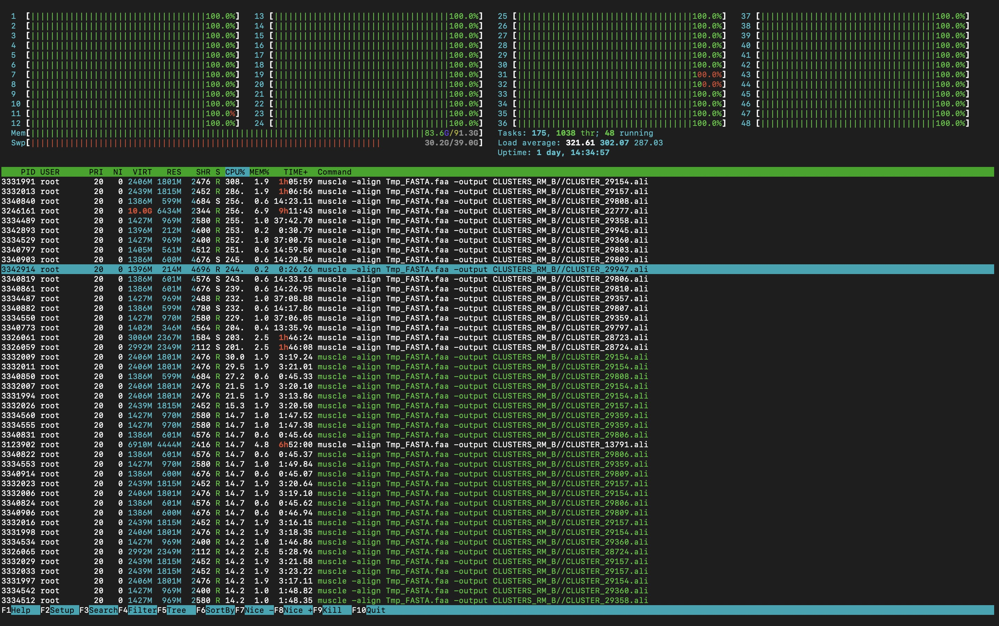

<center></center>

<h1>
<center>LoupeRunner</center>
</h1>


<h1>
<center>iGEM SYSU-Software 2022</center>
</h1>																


## 🚩Introduction

[](https://badge.fury.io/py/LoupeTool) [](https://badge.fury.io/py/LoupeTool) [](https://github.com/sysu-software-2022/LoupeTool)

**A modularized LoupeRunner with step by step functions**

You can run **LoupeRunner** step by step with your customized parameters.

 We strongly recommend you execute **LoupeRunner** on **high performance computing platform(HPC).**


[](https://badge.fury.io/py/LoupeTool) [](https://badge.fury.io/py/LoupeTool) [](https://github.com/sysu-software-2022/LoupeTool)

**A modularized LoupeRunner with step by step functions**

You can run **LoupeRunner** step by step with your customized parameters.

 We strongly recommend you execute **LoupeRunner** on **high performance computing platform(HPC).**


## 🌟Or download the python package

```python
pip install LoupeTool
```

For details see [LoupeTool](https://github.com/sysu-software-2022/LoupeTool)


## 🔌Dependences Installation (CRITICAL)

✩ **Dependent Tools**: The following **4** tools and **5** python packages are significantly critical for your successful execution of LoupeTool.


✩ **Acceptable Operating System:** We strongly recommend you run **LoupeTool** in **Linux** or **macOS**.


#### 1.blast+

- ##### Install with source code package & Configuration

You can click [Latest blast+](https://ftp.ncbi.nlm.nih.gov/blast/executables/blast+/LATEST/) and choose corresponding package (**suffix: tar.gz**) which is applicable to your OS (Linux/macOS)

Or you can just use `wget` to install your package:


> Linux

```shell
wget https://ftp.ncbi.nlm.nih.gov/blast/executables/blast+/LATEST/ncbi-blast-2.13.0+-x64-linux.tar.gz
tar -zxvf ncbi-blast-2.13.0+-x64-linux.tar.gz
```


```shell
mv ncbi-blast-2.13.0+ blast
echo "export PATH=$(pwd)/blast/bin:\$PATH" >> ~/.bashrc
source ~/.bashrc
```


> macOS

```shell
wget https://ftp.ncbi.nlm.nih.gov/blast/executables/blast+/LATEST/ncbi-blast-2.13.0+-x64-macosx.tar.gz
tar -zxvf ncbi-blast-2.13.0+-x64-macosx.tar.gz
```


```shell
mv ncbi-blast-2.13.0+ blast
echo "export PATH=$(pwd)/blast/bin:\$PATH" >> ~/.zshrc
source ~/.zshrc
```

**!  `$(pwd)` is the path where you installed blast+ in.**


#### 2.muscle (v5.1)

See [muscle Version 5.1](https://github.com/rcedgar/muscle/releases/tag/v5.1) for installation.

Then type the following commands:

> Linux

```shell
chmod +x muscle5.1.linux_intel64
mv muscle5.1.linux_intel64 muscle
ln -s muscle /etc/bin
```


> macOS

```shell
chmod + muscle5.1.macos_arm64 # or muscle5.1.macos_intel64
mv muscle5.1.macos_arm64 muscle
ln -s muscle /usr/local/bin

```

For more details see [Muscle5](https://drive5.com/muscle5/)


#### 3.MMseqs2

Please refer to official installation user guide [MMseqs2 User Guide](https://github.com/soedinglab/mmseqs2/wiki#installation)


#### 4.parallel

> Linux 

```shell
sudo apt install parallel
```


> macOS

```shell
brew install parallel
```


#### 5.Python Packages:

##### bio, pandas, numpy, sklearn, imblearn

You can install these python packages by running `pip install -r requirements.txt`


## 👾Quick Example

**! Make sure you have already downloaded all dependencies**

First and foremost, you should configure all parameters in `config.py`, an example showed in below.

> config.py 

```python
from LoupeTool import Loupe
import os
Loupe.LoupeRunner(DefenseSystem_Name="Cas",
                    DefenseSystem_FilePath="./",
                    PTYFile=os.path.join("./", "Cas_INPUT/Database/CDS.pty"),
                    PathToDatabase=os.path.join("./", "Cas_INPUT/Database/ProteinDB"),
                    SeedPath=os.path.join("./", "Cas_INPUT/Archaea_Cas.csv"),
                    NeighborhoodVicinitySize=10000,
                    PermissiveClusteringThreshold=0.3,
                    SortingOverlapThreshold=0.4,
                    SortingCoverageThresold=0.25,
                    ThreadNum=os.cpu_count())

```

After configuration, execute `LoupeRunner.py`,  your data will be processed automatically, if you have no idea of configuring these parameters, please read the following guides:


##### I. Parameters guide:

1. DefenseSystem_Name: ABI, RM, TA, DND, Cas;
2. DefenseSystem_FilePath: Your working directory;
3. PTYFile: your **.pty** file path;
4. SeedPath: your seed **.csv** file path;
5. NeighborhoodVicinitySize: change the bidirectional search domain of seed, if this increase, the search domain will be expand correspondingly. Our Suggestion Value: CRISPR-Cas: 10000，TA: 2000
6. PermissiveClusteringThreshold: this adjust mmseqs cluster parameter(i.e. --min-seq-id) in **step 9**, this will affect sequence similarity. For more details, see:  [MMseqs2 User Guide](https://github.com/soedinglab/mmseqs2/wiki)
7. SortingOverlapThreshold and SortingCoverageThresold: this twos parameters are used to filter **Low matching hit** produced by **PSIBLAST** in **step12**, increase them will result in the spurt of specificity.
8. ThreadNum: thread number should be contingent on your **CPU core number**.

Hint: the most convenient way of managing these relevant paths is create a new directory for processing your data or use existing one and include all your files in this directory.


##### II. For users:

For processing large **seeds** by executing **LoupeRunner,** you may have to wait for longer time, which is contingent on your CPU core number (some bottleneck steps in **LoupeRunner are optimized by parallelization** and the performance is positively correlated with the CPU core number)


> e.g. 48 CPU cores usage in high performance computing platform when processing bulk data during paralleled period.



 You can download **htop** to monitor **LoupeRunner** processing real-time situation just like the above.


## 🧩Documentation

### Experimental Design

> Input and Output files path can be specified in `config.py`

The entire procedure of **LoupeRunner** can be separated into 14 steps pipeline:

- In order to demonstrate every steps precisely, input and output file names are referenced from our example data.


### **Step1: Download genomic data from Refseq/GeneBank**

You need access to genomic data. Genomic data include genomic protein sequence (protein.faa) and protein annotation (genomic.gbff). If you are using the FTP Refseq (https://ftp.ncbi.nlm.nih.gov/refseq/release/archaea/), we recommend using the following code to download large data.
First use the following python scrpit to get url:

```python
# get url from Refseq relese,there we show how to download all genomic data of prokaryotes
# pip install requests
import os
import re
import requests
 
def load_url_context(type ,url):
    # get url
    request = requests.get(url)
    raw_list = re.compile(r'<a.*?>(.*?)</a>').finditer(request.text.strip())
    file_name = "_".join([type,"context.txt"])
    with open(file_name, "w") as f:
        for i in raw_list:
            x = i.group(1)
            if x.endswith("genomic.gbff.gz") or x.endswith("protein.faa.gz"):
                file_https = ''.join([url,x])
                #start with rsync
                file_ftp = file_https.replace("https","rsync")
                #print(file_ftp)
                f.write(file_ftp)
                f.write('\n')
        f.close()    
 
if __name__ == "__main__":
    archaea_url = "https://ftp.ncbi.nlm.nih.gov/refseq/release/archaea/"
    bacteria_url = "https://ftp.ncbi.nlm.nih.gov/refseq/release/bacteria/"
    load_url_context("archaea", archaea_url)
    load_url_context("bacteria", bacteria_url)
```

Then use rsync to download the data:

```bash
#!/bin/bash
# you can modify TXT file to change which data you want to download
while read line
do 
    rsync --copy-links --recursive --times --verbose $line archaea/
done < archaea_context.txt
```

It may cost much more time than use wget, however it 


### **Step2: Preparation of BLAST database**

Unzip the above files and merge all .faa files into a single file (ProteinSequences.faa):

```bash
cat *protein.faa > YourWorkPath/ProteinSequences.faa
```

Create a BLAST database using the makeblastdb command:

```bash
makeblastdb -in ProteinSequences.faa -out ProteinsDB -dbtype prot -parse_seqids
```


### **Step3: Preparation of CDS**

The annotation data is very large, especially the bacterial genome data, but there is a lot of information we do not need, so we need to further operation to simplify the content.
We use CDS_extract.py to import .gbff file. The output data format(Text file, delimited by Tab) is like:

| LocusTag      | ORFStart:ORFStop | Strand | OrganismID                             | ContigID    | Accession      |
| ------------- | ---------------- | ------ | -------------------------------------- | ----------- | -------------- |
| METBO_RS00005 | 51:1401          | +      | Methanobacterium lacus-GCF_000191585.1 | NC_015216.1 | WP_013643605.1 |


### **Step4: Extracting CDS**

This step is commented in the code, coding sequence(CDS) file is optional, if you need to extract seeds from CDS file, this step offers you a direct way to do so.


### **Step5: Extracting seeds**

- Input: `Archaea_Cas.csv`,  `CDS.pty`

Fetching seeds of interest (e.g. Archaea_Cas.csv) in from (e.g. CDS.pty) provided in database, essential attribute includes: 

assembly_accession, locus_tag, product_accession, contigID, start, end.

Our example show in the table below: 

> Archaea_Cas.csv (partial)

| Assembly_accession | Locus_tag      | Product_accession | ContigID   | Start   | End     |
| ------------------ | -------------- | ----------------- | ---------- | ------- | ------- |
| GCA_000230715.3    | Natgr_1399     | AFZ72610.1        | (Optional) | 1390703 | 1391386 |
| GCA_000970265.1    | MSLAZ_2290     | AKB75551.1        | (Optional) | 2975643 | 2978066 |
| GCA_900079115.1    | SSOP1_1525     | SAI85079.1        | (Optional) | 1340732 | 1341376 |
| GCA_000189935.2    | AABMKBHA_00165 | AABMKBHA_00165    | (Optional) | 33470   | 34630   |
| GCA_000979385.1    | EO92_18095     | KKG11218.1        | (Optional) | 53457   | 54251   |


- Output:  `Seeds_Cas.tsv`

> Seeds_Cas.tsv (partial)

| Assembly        | LociID        | Accession      | ContigID          | Start   | End     |
| :-------------- | ------------- | -------------- | ----------------- | ------- | ------- |
| GCF_001729285.1 | A9507_RS00880 | WP_069582310.1 | NZ_LZPM01000003.1 | 122396  | 122990  |
| GCF_000214725.1 | MSWAN_RS07020 | WP_013825929.1 | NC_015574.1       | 1538607 | 1539333 |
| GCF_900095295.1 | MCBB_RS06490  | MCBB_RS06490   | NZ_LT607756.1     | 1386026 | 1387868 |
| GCF_900095295.1 | MCBB_RS06465  | WP_071908025.1 | NZ_LT607756.1     | 1380806 | 1381325 |
| GCF_000302455.1 | A994_RS11405  | WP_004031769.1 | NZ_AMPO01000012.1 | 2073    | 2592    |


### **Step6:  Selecting neighborhoods**

Select neighborhood around seeds

- Input:  `Seeds_Cas.tsv`
  - Parameter: 
    - NeighborhoodVicinitySize(default: 10000): change the bidirectional search domain of seed(i.e. offset), if this increase, the search domain will be expand correspondingly. 


- Output: `Vicinity_Cas` (list of proteins in vicinity of seeds)

```
===
WP_013644337.1	708731..710093	+	Methanobacterium lacus-GCF_000191585.1	NC_015216.1
WP_013644338.1	710089..710788	+	Methanobacterium lacus-GCF_000191585.1	NC_015216.1
WP_013644339.1	711103..711739	+	Methanobacterium lacus-GCF_000191585.1	NC_015216.1
WP_013644340.1	711758..712142	+	Methanobacterium lacus-GCF_000191585.1	NC_015216.1
WP_013644341.1	712125..712428	+	Methanobacterium lacus-GCF_000191585.1	NC_015216.1
WP_013644342.1	712458..714444	-	Methanobacterium lacus-GCF_000191585.1	NC_015216.1
WP_013644343.1	714508..714814	+	Methanobacterium lacus-GCF_000191585.1	NC_015216.1
WP_013644344.1	714975..716799	-	Methanobacterium lacus-GCF_000191585.1	NC_015216.1
WP_013644345.1	717225..717567	+	Methanobacterium lacus-GCF_000191585.1	NC_015216.1
WP_013644346.1	717609..718158	+	Methanobacterium lacus-GCF_000191585.1	NC_015216.1
WP_013644347.1	718126..718936	+	Methanobacterium lacus-GCF_000191585.1	NC_015216.1
WP_013644348.1	718970..719564	-	Methanobacterium lacus-GCF_000191585.1	NC_015216.1
WP_013644349.1	719950..720817	+	Methanobacterium lacus-GCF_000191585.1	NC_015216.1
WP_013644350.1	720894..721371	+	Methanobacterium lacus-GCF_000191585.1	NC_015216.1
WP_013644351.1	721367..722756	-	Methanobacterium lacus-GCF_000191585.1	NC_015216.1
WP_013644352.1	723448..724663	+	Methanobacterium lacus-GCF_000191585.1	NC_015216.1
WP_013644353.1	724962..725496	-	Methanobacterium lacus-GCF_000191585.1	NC_015216.1
WP_013644354.1	725806..726502	+	Methanobacterium lacus-GCF_000191585.1	NC_015216.1
WP_013644355.1	726503..726824	+	Methanobacterium lacus-GCF_000191585.1	NC_015216.1
WP_013644356.1	726849..727638	+	Methanobacterium lacus-GCF_000191585.1	NC_015216.1
WP_013644357.1	728039..728633	+	Methanobacterium lacus-GCF_000191585.1	NC_015216.1
WP_013644358.1	728644..729043	+	Methanobacterium lacus-GCF_000191585.1	NC_015216.1
WP_013644359.1	729210..732126	+	Methanobacterium lacus-GCF_000191585.1	NC_015216.1
===
WP_013825920.1	1526093..1526849	+	Methanobacterium paludis-GCF_000214725.1	NC_015574.1
WP_013825921.1	1527015..1527132	+	Methanobacterium paludis-GCF_000214725.1	NC_015574.1
WP_013825922.1	1527204..1527612	+	Methanobacterium paludis-GCF_000214725.1	NC_015574.1
WP_013825923.1	1527926..1528274	-	Methanobacterium paludis-GCF_000214725.1	NC_015574.1
WP_013825924.1	1528859..1529774	-	Methanobacterium paludis-GCF_000214725.1	NC_015574.1
WP_013825925.1	1529770..1530721	-	Methanobacterium paludis-GCF_000214725.1	NC_015574.1
WP_013825926.1	1536731..1536995	-	Methanobacterium paludis-GCF_000214725.1	NC_015574.1
WP_048188005.1	1537000..1537945	-	Methanobacterium paludis-GCF_000214725.1	NC_015574.1
WP_048188364.1	1538060..1538582	-	Methanobacterium paludis-GCF_000214725.1	NC_015574.1
WP_013825929.1	1538607..1539333	-	Methanobacterium paludis-GCF_000214725.1	NC_015574.1
WP_013825930.1	1539392..1541603	-	Methanobacterium paludis-GCF_000214725.1	NC_015574.1
WP_013825931.1	1541612..1542230	-	Methanobacterium paludis-GCF_000214725.1	NC_015574.1
WP_013825932.1	1542226..1543225	-	Methanobacterium paludis-GCF_000214725.1	NC_015574.1
WP_013825933.1	1543225..1544599	-	Methanobacterium paludis-GCF_000214725.1	NC_015574.1
WP_013825934.1	1545276..1546743	-	Methanobacterium paludis-GCF_000214725.1	NC_015574.1
WP_052296851.1	1546885..1547275	+	Methanobacterium paludis-GCF_000214725.1	NC_015574.1
WP_013825936.1	1547556..1548792	-	Methanobacterium paludis-GCF_000214725.1	NC_015574.1
WP_013825937.1	1549070..1550777	-	Methanobacterium paludis-GCF_000214725.1	NC_015574.1
WP_013825938.1	1551299..1552286	-	Methanobacterium paludis-GCF_000214725.1	NC_015574.1
WP_013825939.1	1552375..1553728	-	Methanobacterium paludis-GCF_000214725.1	NC_015574.1
WP_013825940.1	1553724..1554780	-	Methanobacterium paludis-GCF_000214725.1	NC_015574.1
===
```


### **Step7: Collecting protein IDs**

- Input:  `Vicinity_Cas` (list of proteins in vicinity of seeds)

Extract and sort proteins in vicinity of seeds in ascending order forming VicinityIDs in `.lst` file.


- Output: `VicinityIDs_Cas.lst  ` (partial)

```
WP_004030635.1
WP_004030636.1
WP_004030637.1
WP_004030638.1
WP_004030640.1
WP_004030642.1
WP_004030643.1
WP_004030644.1
WP_004030645.1
WP_004030646.1
.....
```


### **Step8: Fetching protein sequences**

Tool `blastdbcmd`required

- Input: `VicinityIDs_Cas.lst`, Database

using the file generated in Step 7 ( `VicinityIDs_Cas.lst`) to get protein sequences from database.


- Output: `Vicinity_Cas.faa` (partial)

```
>ref|WP_004030635.1| glycosyltransferase family 4 protein [Methanobacterium formicicum]
MDKIAISVVVDIFDDEGTTVRPKRVAELLKNNFDTCFINRSSSDLKEINGIPVHIVKPAGTKLWNIKLFGLLSGNDFDFV
YCSSDWFGFLTYFMLKRFYDYKIIFEAHTIISEEFKERKAHPFKVFFFQVLEKFAIKHSDYVVALSENIYDYYSYNKNIE
LVHVFIDEELFISDVKRKINDDKKVIGLIGPFDEFSNQYFLEFLRKNIDQFDDRISFRIIGKCQDKIQHPRIEYTGYMNS
IHDYVNVLSSLDGLLVPSRVATLGPLNKIIEAMACSVPVFTTPKGIVGLYNIKPGQEIYVLEEDDLVCGLNNHVFSDELI
NIAKNARLYVEKYYSKKANEKKLLRIFNRLNEG
>ref|WP_004030636.1| glycosyltransferase family 4 protein [Methanobacterium formicicum]
MIIGYFSSTFPYSVSNPKYFCGGSSLATHSLVNEISNSDIDIKVFTTSADSEDHLDMDGRMGIYRYATKIKLLTSPISLG
LFHKPLEHDVDLVHVSFDMPPGPFAAYRYARKKSLPLILTYHGDWDPDYGSFVRKVGVSINNKFVSDLLSYADIIISPSK
LYAKKSKYLSKYLDKIRVIPNGIDLDEFQLNYSQSECREKLNLPLECKIILFFGYLTPYKGPDILLGAFREVLKNQPDTV
LLFAGNGNMEDELKKLARQWNIQDNVIFAGFVDKKMRSLYYKSADIFCLPSTMSTECYPLAILEAMASGVPVVASDIGGI
PDIIENNVNGLLVTPTNPEKLEDNLNLLLQNPEIRAKFSENALKGIKKYSWKNIATETLKLYESLLENR
```


### **Step9:  Clustering protein seqiences**

- Input:  `Vicinity_Cas.faa`
  - Parameter:
  
    - PermissiveClusteringThreshold(default: 0.3)
  
    

Run the following command to cluster protein sequences contained in the file  `Vicinity_Cas.faa` using a
sequence similarity cutoff value of 0.3 and save results in the `VicinityPermissiveClustsLinear_Cas.tsv` file:

​	

- Output: `VicinityPermissiveClustsLinear_Cas.tsv` (partial)

```
WP_048191534.1	WP_048191534.1 WP_004030642.1 WP_023992731.1
WP_071907103.1	WP_071907103.1 WP_013644342.1 WP_013826017.1
WP_004031781.1	WP_004031781.1 WP_100906549.1
WP_013825921.1	WP_013825921.1 WP_095651998.1 WP_100906253.1 WP_095651996.1 WP_023992734.1 WP_013826664.1 WP_095651994.1 WP_095651997.1 WP_179288731.1 WP_023992735.1 WP_100906252.1 WP_023992122.1 WP_232727999.1
WP_013826016.1	WP_013826016.1 WP_013644343.1 WP_071907102.1
```


### **Step10: Making profiles** (Parallelized)

 ▷ `blastdbcmd`, `muscle` tools required

- Input:  `VicinityPermissiveClustsLinear_Cas.tsv`, Database

Make profiles for the clusters in `VicinityPermissiveClustsLinear_Cas.tsv`, 

This step will create a protein profile for each permissive cluster for proteins from the database using the Muscle program and will save the profiles to the CLUSTERS\_\${DefenseSystem_Name} folder(\${DefenseSystem_Name} is a variable which is configured in `config.py` ) with an ‘.ali’ extension and CLUSTER_ prefix with line number after the prefix as cluster ID (this step will create the  CLUSTERS\_\${DefenseSystem_Name} folder if it doesn't exist in the current directory).

▷ For different configuration of muscle in this step, see [muscle documents](https://drive5.com/muscle5/manual/).


- Output: ``CLUSTERS_Cas/CLUSTER_*.ali``

> CLUSTER_5.ali

```
>ref|WP_071907103.1| NFACT family protein [Methanobacterium congolense]
MKTMSNVDVYAICTELKDTLKDARVDKAYQPTKDTVLIRFHIPGKGRTDVVFQAGTRVHTTQYPPENPKIPPSFPMLLRK
HLKGGTITDVRQHHFDRIMELDIQKEHRYTLVVELFSKGNIILVDEEGTIILPLKRKLWQDRKISSKEIYKYPPENEFNP
LKAEKEDIKKLFMDSDRDVVRTLAGSGLGGLYAEEIVLRSDVDKKKSATDLEEAELEAIYNAFQELFQPLKDHAFHPRII
SGEKEDVLPLELRKYEGFESKTFETYNQAADEFYSSRVGEDIKKVHEDIWAREIGKYEKRMKIQLETLENFKKTIVESTI
KGDALYAHYHEVQDMINTIMEARKNYSWAEVSSTIKKAKKHGAAGLESIEAVDKMGVMDLNLEGVRVQVDSNIGIPENAE
KYYNKGKKAKRKINGVNIAIEKTQAEIDKAKNKREIAMEKVLVPQKRVRKELKWFEKLRWFVSSDGNLVIGGRDATTNEM
VVKKHLENRDVYFHSDIHGAASVVVKGGEGEISEETLIEAASFSASFSSAWQKGFSTHDVYWVHPDQVSKTPQSGEFVAK
GAFIIRGSRNYMRGVPLLVAVGIVDYEGERVMAGPPEAVSAYTDNYAVIKPGYTKKEEMARQIRNKIDNEGVLSIEDVVR
VLPSGKCDFVDKRSLKW----KR
>ref|WP_013644342.1| NFACT family protein [Methanobacterium lacus]
MKAMSNVDVYAICKELGEVLKDARVQKAYQPTKDTVLIRFHVPGKGRVDVVFQAGFRVHTTQYPPQNPKIPPNFPMLLRK
YIKGGTVTAVKQHNFDRIMRIDIQKEEKFSLVVELFAKGNIILLDHEDKIILPLKRKVWQDRKISSKEEYKYPPERGMNP
LEVDKEELKTILTNSDRDIIRTLARNGLGGLYAEEIALRSDVAKNKTADEITDEDVEAIQSAINSIFDPLKTFNFNPQIV
KGKKEDVLPLDLLMYKDFEKESFESFNDAADEFYSSIVGEDIVNVNEEVWSGEVGKFEKRLNIQLETLEKFEKTVKDSKI
KGEAIYSDYQAIENILNIIHSARETNSWLEIIATVKKAKKDKVPGLEIIESIDKMGVLTLNLDGVRVNIDSSMGIPENAE
IYYNKGKKAKRKIKGVHIAIEKTRKEIDKAKNKREIEMEKVLVPQKRVKKDLKWYEKLRWFVTSDGLLAIGGRDATTNEM
VVKKHMENRDIYFHSDIHGASSVILKAGEGEIPERSINETAAFAACFSSAWSKGLGSTDVYWVHPEQVSKTPQSGEFVAK
GAFIIRGSRNYMRGLPLTLSLGIVDYEGSRIMAGPPEAVSNLTEKYVTVKPGYIKKEEIARQIRNNIDDEKLLSIEDVVR
VLPSGKCDFLDSKGFKR--NKKR
>ref|WP_013826017.1| NFACT family protein [Methanobacterium paludis]
MKAMSNVDIYTICNELKEILKDARVDKAYQPTRDTVLIRFHVPGKGRVDVVFQAGLRVHTTQYPPENPQIPPSFPMILRK
HLKGGNVTCVKQHNFDRILKINIQKEHKYSLVIELFAKGNIILLDEEGTIIMPLKRKLWEDRNISSKEEYKYPPERGINP
LEVTKEELETLFAESDRDLIRTLASSGLGGLYAEEVMLRSGVKKDKPSSDITPEELDFIHNAMSDVFSPLKTAQFHPQII
SSEKDDVLPLNLTKYEKYEKKTFETFNQAADEFYSSIVGDDIKQVHEDVWAAEVGKFEKRLKIQMETLEKFKDTIVKTKI
KGEAIYSNYQNIQNILDIIHNARETYSWLDIIDIIKKGKKEKVSGLDIIESLDKMGVLTLNLDGTIVNVDSNMSIPENAE
IYYNKGKKAKRKISGVNIAIEKTMKEVERAKNKREIAMEKVLVPQKRVRKELKWFEKLRWFLSSDGLLVIGGRDATTNEM
IVKKHMENRDIYFHSDIHGAASVVVKAGEGEVPESTLNETASFAGSFSSAWSAGFGSTDVYWVHPDQVSKTPQSGEFVGK
GAFIIRGSRNFIRNAPLLVAVGIVDYEGKRIMAGPPEALVKYTDNYVVIKPGYTKKEEMARQIRHKIDEEKLLSIEDVVR
VLPSGKCDFVDKRQFKGRDFKRK

```


### **Step11: Running PSI-BLAST for profiles** (Parallelized)

▷ `psiblast` tool required

- Input:  ``CLUSTERS_Cas/CLUSTER_*.ali``, Database
  - Parameter:  
    - ThreadNum: Number of threads (CPUs) to use in blast search.


The script in of step executes a PSIBLAST search of the genomic database with the
profiles created at Step 10 used as queries and save results for each cluster with a ‘.hits’ extension in
the CLUSTERS\_\${DefenseSystem_Name} folder.

For more information, see [BLAST® Command Line Applications User Manual](https://scicomp.ethz.ch/public/manual/BLAST/BLAST.pdf)


- Output: ``CLUSTERS_Cas/CLUSTER_*.hits``

> CLUSTER_1.hits

```
# PSIBLAST 2.13.0+
# Iteration: 1
# Query: ref|WP_013825920.1| hypothetical protein [Methanobacterium paludis]
# Database: ./Cas_INPUT/Database/ProteinDB
# Fields: query id, subject id, subject length, s. start, s. end, evalue, query seq, subject seq, q. start, q. end, score
# 29 hits found
ref|WP_013825920.1|	ref|WP_013825920.1|	251	1	251	0.0	MGLQLHPIISIPFGVITTIVFLQVFGIPTLPLGGNAGILILIPVAIIFGGFTATYFTDTNDKKIIYSICVGIIISFITLILGLKEYIGYNDVVVMFISFCVMAGIGGFLGKIADEVNRKILEIKYKILSNISESKKNILKNVLISILFVGMMSFIFVGLIFMPFGNPDIIIIQSSGFSPNSTLISPSTVTWINNDTKIHRVVSDYGLFDSGNITPGQSYSHYFRDVKAYPYHDSIDPSMKGTVLLPMSPGE	MGLQLHPIISIPFGVITTIVFLQVFGIPTLPLGGNAGILILIPVAIIFGGFTATYFTDTNDKKIIYSICVGIIISFITLILGLKEYIGYNDVVVMFISFCVMAGIGGFLGKIADEVNRKILEIKYKILSNISESKKNILKNVLISILFVGMMSFIFVGLIFMPFGNPDIIIIQSSGFSPNSTLISPSTVTWINNDTKIHRVVSDYGLFDSGNITPGQSYSHYFRDVKAYPYHDSIDPSMKGTVLLPMSPGE	1	251	1286
ref|WP_013825920.1|	ref|WP_004031972.1|	114	6	112	4.61e-27	VLISILFVGMMSFIFVGLIFMPFGNPDIIIIQSSGFSPNSTLISPSTVTWINNDTKIHRVVSDYGLFDSGNITPGQSYSHYF--RDVKAYPYHDSIDPSMKGTVLLPMSPG	LLIGLPIFGVCLLLLLGLHDIPAE----IYVGNSGFDPNVTNIYPSKVTWTNNDSQIHRIISDDGLFDSGNLSPGENYTYDFSYHKNKIYKYHDSTNTSLKGTIQIEMGPG	142	250	251
ref|WP_013825920.1|	ref|WP_008517151.1|	114	27	112	1.08e-24	PDIIIIQSSGFSPNSTLISPSTVTWINNDTKIHRVVSDYGLFDSGNITPGQSYSHYF--RDVKAYPYHDSIDPSMKGTVLLPMSPG	PTEIYVGNSGFDLNVTNIYPSKVTWTNNDSQIHRIVSDDGLFDSGNLSPGENYTYDFSYHKNRIYKYHDSTNTSLKGTIQIEMGPG	167	250	235
ref|WP_013825920.1|	ref|WP_052374236.1|	116	2	112	1.86e-22	KKNILKNVLISILFVGMMSFIFVGLIFMPFGNP--DIIIIQSSGFSPNSTLISP--STVTWINNDTKIHRVVSDYGLFDSGNITPGQSYSHYFRDVKAYPYHDSIDPSMKGTVLLPMSP	KRNLSVWIVLSILFV-------VGISGCTFKQPTNDTVVIQNEGFSP-SALIVPVNTTVTWINKDPVTQNLVSDTGLFESGNLSNGQSFNYTFNQTGSYHYYSNLYPNMKGSIIVTTSP	135	249	220
ref|WP_013825920.1|	ref|WP_223790141.1|	128	4	106	7.56e-21	SILFVGMMSFIFVGLIFMP---FGNPDIIIIQSSGFSPNSTLISP-STVTWINNDTKIHRVVSDYGLFDSGNITPGQSYSHYFRDVKAYPYHDSIDPSMKGTVLL	NLIFVGV--FLIFGIVAVSGCTSSQTSIVTIQNSSFNPSTLNVQVGTTVTWINKDTTTHDVVSDTGLFNSGNLTNGMSYNYTFNQTGSFAYHSAIQPSMTGTIVV	145	245	210
ref|WP_013825920.1|	ref|WP_081882600.1|	130	4	108	8.80e-19	SILFVGMMSFIFVGLIFMPF-----GNPDIIIIQSSGFSPNSTLISP-STVTWINNDTKIHRVVSDYGLFDSGNITPGQSYSHYFRDVKAYPYHDSIDPSMKGTVLL	NLIFVGV--FLVLGIVAVSGCTSNQTSGNTVTIQNMAFNPSTLNVKVGTTVTWINKDSVTHDVVSDTGLFNSGNLTNGMSYNYTFNQTGSFPYHCAIHPSMTGTIVV	145	245	196
ref|WP_013825920.1|	ref|WP_081882599.1|	128	31	110	3.19e-18	IIIQSSGFSPNSTLISP-STVTWINNDTKIHRVVSDYGLFDSGNITPGQSYSHYFRDVKAYPYHDSIDPSMKGTVLLPMS	VTIQNMAFNPSTLNVQVGTTVMWINKDSTTHHVVSDTGVFDSGDLATGQSYNYTFNQTGSFPYHCSIHPSMTGTIVVSTS	170	248	192
ref|WP_013825920.1|	ref|WP_052374129.1|	161	4	109	7.24e-17	ISILFVGMMSFIFVGLIFMPFGNPDIIIIQSSGFSPNSTLISPST-VTWINNDTKIHRVVSDYGLFDSGNITPGQSYSHYFRDVKAYPYHDSIDPSMKGTVLLPMS	INFIFLGILLTIGIVAVSGCTSQSSTVTIQNMAFNPSTVHITGSTTIIWINKDNIEHEVVSDTGLFDSGVLAPGESFNYTFNQAGDYAYHCAIHPSMVGIIVVSSS	144	248	185
ref|WP_013825920.1|	ref|WP_223792080.1|	98	10	90	4.31e-16	NPDII--IIQSSGFSPNSTLISP--STVTWINNDTKIHRVVSDYGLFDSGNITPGQSYSHYFRDVKAYPYHDSIDPSMKGTV	NPQTIQLLYKIEAFSP-STLIVPVNTTVTWINKDPVTQNLVSDTGLFESGNLSNGQSFNYTFNQTGSYHYHSNIHPNIKGSI	166	243	175
ref|WP_013825920.1|	ref|WP_052375909.1|	145	68	144	5.14e-15	IIIQSSGFSPNS-TLISPSTVTWINNDTKIHRVVSDYGLFDSGNITPGQSYSHYFRDVKAYPYHDSIDPSMKGTVLL	ISIQNMAFNPNKITVKSGTNVQWINNDNTQHQIVSDSGAFQSNTLNPGDSYNFFFDKTGIYGYHDALNSTITGTIVV	170	245	171
ref|WP_013825920.1|	ref|WP_069583285.1|	145	68	144	1.37e-13	IIIQSSGFSPNS-TLISPSTVTWINNDTKIHRVVSDYGLFDSGNITPGQSYSHYFRDVKAYPYHDSIDPSMKGTVLL	ISIGNMAFNPNKITVKSGTNVQWINNDNTQHQIVSDTGAFQSTILNPGDSYNFFFAKTGIYGYHDALNSTITGTIIV	170	245	161
ref|WP_013825920.1|	ref|WP_071906376.1|	370	1	145	2.85e-13	LQLHPIISIPFGVITTIVFLQVFGIPTLPLG-------GNAGILILIPVAIIFGGFTATYFTDTNDKKIIYSICVGIIISFITLILGLKEYIGYNDVVVMFISFCVMAGIGGFLGKIADEVNRKILEIKYKILSNISESKKNILKNVLISILFVGMMSFIFVGL	MKFHPAISIILGIVTILMWFILAGILGLDFSKSISNTSGGATLIILI-----LGGFVATYFTE--DKKIRYSIYEGLIF---TAFVGLSKNLKL--IFAAFIAYVLFIGIGGFIGKMTDNKERQNFK-------NHFEKGFNPIITIVMGFIVANFFYYLLLGI	3	159	167
ref|WP_013825920.1|	ref|WP_071906376.1|	370	123	313	1.07e-11	HPIISIPFG-VITTIVFLQVFGIPTLPLGGN--AGILILIPVAIIFGGFTATYFTDTNDKKIIYSICVGIIISFITLILGLKE---YIGYNDVVVMFISFCVMAGIGGFLGKIADEVNRKILEIKYKILSNISESKKNILKNVLISILFVGMMSFIFVGLIFMPFGNPDIIIIQSSGFSPNSTLISPSTVTWINNDTKIHRVVSDYGLF	NPIITIVMGFIVANFFYYLLLGITNIYTSYNIKTAALTIAVISNVIGGFTATFFA--KEKKIQYGIYTGLIILISSLAMKLIHGTLHVNYSSISI--VEYLLFAGIGGFIGKITDNTGRQSLK---KRFNNGYNPIITIVMGYFIATFFNNSILLITCTYNSNPFGVTQFIV------AAISFVIGGFTATFFAKEKKI-----QYGIY	6	208	155
ref|WP_013825920.1|	ref|WP_071906376.1|	370	249	359	4.74e-07	HPIISIPFGVITTIVFLQVFGIPTLPLGGNA-GILILIPVAIIF--GGFTATYFTDTNDKKIIYSICVGIIISFITLIL----GLKEYIGYNDVVVMFISFCVMAGIGGFLGK	NPIITIVMGYFIATFFNNSILLITCTYNSNPFGVTQFIVAAISFVIGGFTATFFA--KEKKIQYGIYTGMIILIVNLVLQLIYGPTIHEPYYIKIGKIAGYLIASGIGGYLGK	6	111	119
ref|WP_013825920.1|	ref|WP_048082919.1|	253	1	147	8.06e-13	LQLHPIISIPFGVITTIVFLQVFGIPTLPLGGNAGILILIPVAI-IFGGFTATYFTDTNDKKIIYSICVGIIIS--FITLILGLKEYIGYNDVVVMFISFCVM--AGIGGFLGKIADEVNRKILEIKYKILSNISESKKNILKNVLISILFVGM	MKVHPVISIILGIIAGIILLI---ISIKLFSGNALVSAATNFAISIIGGFIATYFA--KEKKIRYGIYEGIILSIMFISLVSLIHTTYIYFLIALVGIIFEMLLPATIGGFIGKMTEGNNRKSFKMKY--LNRNLHPIITIIAGILVTIVLMSL	3	151	161
ref|WP_013825920.1|	ref|WP_048082919.1|	253	128	243	6.37e-11	LHPIISIPFGVITTIVFLQVFGIPTLPLGGNAGILILIPVAIIFGGFTATYFTDTNDKKIIYSICVGII-------ISFITLILGLKEYIGYNDVVVMFISFCVMAGIGGFLGKIADE	LHPIITIIAGILVTIVLMSLFGSFHLKISMGITYFLMATIFFAAGGFVTAFL--AREKKMLYGIYEGIVAVIYTILARYIGIIMGLNTTVDYYLIIGAVIGYFLAAAIGSYLGKAAGE	5	115	147
ref|WP_013825920.1|	ref|WP_069584028.1|	141	1	106	2.36e-12	LQLHPIISIPFGVITTIVFLQ---VFGIPTLPLGGNAGILILIPVAIIFGGFTATYFTDTNDKKIIYSICVGIIISFITLILGLKEYIGYND---VVVMFISFCVMAGIGGFLGKI	MKLHPLISIILGLFVTLLLVMIPLVFDAP--PLVGNAMFIF----AFILGGFIATYF--SKDKKIRYSIYMGLIAAVLFSIIESPD--GFNKLPAILLGFIQFPGMSLIGGLPGKI	3	112	152
ref|WP_013825920.1|	ref|WP_052374005.1|	111	30	109	2.26e-11	IIIIQSSGFSPNSTLISPSTVTWINNDTKI-HRVVSDYGL--FDSGNITPGQSYSHYFRDVKAYPYHDSIDPSMKGTVLL	IIIAHETLTWTNSTIKVGNNVTWINHDFAVNHEIVSDSANYPFDSGVLKNGQSYNLTFTQPGTYNYHDKLNPNLKGTIIV	169	245	143
ref|WP_013825920.1|	ref|WP_052375935.1|	109	3	108	2.98e-11	MSFIFVGLIFMPFG-----------NPDIIIIQSSGFSPNSTLISPSTVT-WINNDTKIHRVVSDYGLFDSGNITPGQSYSHYFRDVKAYPYHDSIDPSMKGTVLL	LNFIRIGIILLVIGVISISGCTQEKQTNTIIIQNFTFKPNPMHVKAGDVVRWTSHDNAPHKIVSDTGNFESPDLNNGDTFTYTFDKKGEFNYHDELDSSIKGKVIV	152	245	142
ref|WP_013825920.1|	ref|WP_157197598.1|	120	3	117	7.33e-11	QLHPIISIPFGVITTIVFLQV-FGIPTLPLGGNAGIL--ILIPVAIIFGGFTATYFTDTNDKKIIYSICVGIIISFI--TLILGLKEYIGYNDVVVMFISFCVMAGIGGFLGKIADEVNR	KFNPVISIISGIIVTITMAYVGFLIIDTP---NFGILDIILLCFSLVIGGFISTYFTE--KRRIVYGVCEGLILSIMCATYVVGTGKGLSYINYIAAYINVALGFVSATYIGSILGRKNR	4	118	140
ref|WP_013825920.1|	ref|WP_069583157.1|	356	1	110	1.14e-10	LQLHPIISIPFGVITTIVFLQVFGIPTLPLGGNAGILILIPVAIIFGGFTATYFTDTNDKKIIYSICVGII--ISFIT--LILGLKEYIGYNDVVVMFIS----FCVMAGIGGFLGKI	MRLHPIKSIIIGAVTAITLL---GISTLTFYNSLAFGILNFAAPLIGGFIATYF--TSKRMVRYGACAGIISAAAFVAFEFILG---NIGLEAIPLMFISSSIIFGVIAGLGGITGEI	3	112	147
ref|WP_013825920.1|	ref|WP_169740445.1|	93	16	92	2.74e-10	IIIQSSGFSPNSTLISPSTVT-WINNDTKIHRVVSDYGLFDSGNITPGQSYSHYFRDVKAYPYHDSIDPSMKGTVLL	IIIQNFTFKPNPMHVKAGDVVRWTSHDNAPHKIVSDTGNFESPDLNNGDTFTYTFDKKGEFNYHDELDSSIKGKVIV	170	245	134
ref|WP_013825920.1|	ref|WP_048082918.1|	356	1	115	3.03e-09	LQLHPIISIPFGVITTIVFLQVFGIPTLPLGGNAGILILIPVAIIFGGFTATYFTDTNDKKIIYSICVGII--ISFIT--LILGLKEYIGYNDVVVMFISFCVMAG-IGGFLGKIADEVNRKI	MRLHPIKSIILGAVIAITLL---GISALVFYNSLAFGILNFVAPLIGGFIATYF--TSKRMARYGACAGIISAAAFVAFEFILG---NIGEDAIIIMFISFSFIFGVIAGLIGIIGGIISNRV	3	120	136
ref|WP_013825920.1|	ref|WP_069585799.1|	375	1	172	7.70e-09	LHPIISIPFGVITTIVFLQVFGIPTLPLGGNAGILILIPVAIIFGGFTATYFTDTNDKKIIYSICVGIIISFITLILGLKEYIGYNDVVVMFISFCVMAGIGGFLGKIADEVNRKILEIKYKILSNISESKKNILKNVLISILFVGMMSFIFVGLIFMPFGNPDIIIIQSSGFSPNSTLISPSTVTWINNDTKIHRVVSDYGLF	MKPFLSIILALITTIL-LFICEI-SLSVALNIYLGSLTVFLFILGGGIATWFAA--GKKIRYSIYYGLILAVITLVLG--------DYRVLIFA-PIFAGIGGFLGKMADKDSRQTFNGYHPVIAIIVGIIVMYIYNVFLGSV-TGAYDLSSSGLIGFVIG---AITLAVGGF----------TTTFLSKEKKI-----QYGIY	5	208	133
ref|WP_013825920.1|	ref|WP_145975997.1|	117	5	107	2.23e-08	HPIISIPFGVITTIVFLQVFGIPTLPLGGNAGILILIPVAIIFGGFTATYFTDTNDKKI-IYSICVGIIISFITLILGLKEYIGYNDVVVMFISFCVMAGIGGFLGK	HPVIAIILGNIIT-GFLGGFVI-ILPISLLSHILVIF--IFVLGGFSATYLSRTNKATIGFYNSLLYSISSLIGAIFIFKTGLTPNKVLILFIYFPILGLIGGFIAK	6	111	122
ref|WP_013825920.1|	ref|WP_223790876.1|	127	46	125	7.08e-08	IIIIQSSGFSPNSTLISPSTVTWINNDTKI-HRVVSDYG--LFDSGNITPGQSYSHYFRDVKAYPYHDSIDPSMKGTVLL	IIITHETLTWNNSTIKVGNNITWINRDFAIEHEIVSNTSNYAFDSGVLKNGQSFSLNFTKAGTYNYYDKLHPNLSGIIIV	169	245	119
ref|WP_013825920.1|	ref|WP_218105063.1|	123	7	88	1.23e-07	VFGIPTLPLGGNAGILILIPVAIIFGGFTATYFTDTNDKKIIYSICVGIIISFITLILGLKEYIGYND---VVVMFISFCVMAGIGGFLGKI	VFDAP--PLVGNAMFIF----AFILGGFIATYF--SKDKKIRYSIYMGLIAAVLFSIIESPD--GFNKLPAILLGFIQFPGMSLIGGLPGKI	24	112	117
ref|WP_013825920.1|	ref|WP_223790185.1|	243	3	114	4.11e-07	QLHPIISIPFGVITTIVFLQVFG--IPTLPLGGNAG---ILILIPVAIIFGGFTATYFTDTNDKKIIYSICVGIIISFITLILGLKEYIGYNDVVVMFISFCVMAG----IGGFL	RFHPVIAIITGSFFIFIINQIMNYIFDSIPINGMLGSELITILVPVLLILGGFITAFITNRN--RLLCAFCVGLFFPIINNAINI-AYLNSISAIVLFVLGALFAALITTLGGFI	4	109	118
ref|WP_013825920.1|	ref|WP_156095866.1|	66	3	64	6.14e-07	STVTWINNDTKI-HRVVSDYG--LFDSGNITPGQSYSHYFRDVKAYPYHDSIDPSMKGTVLL	NNITWINRDFAIEHEIVSNTSNYAFDSGVLKNGQSFSLNFTKAGTYNYYDKLHPNLSGIIIV	187	245	108
# BLAST processed 1 queries

```


### **Step12: Sorting blast hits** 

- Input:  ``CLUSTERS_Cas/CLUSTER_*.ali``, `CDS.pty`, `VicinityIDs_Cas.lst`, `Seeds_Cas.tsv`, `Vicinity_Cas.tsv`

  - Parameters: 

    - (1) SortingOverlapThreshold:

      Overlap threshold; hits are subject to sorting between two profiles if they overlap by more than
      the threshold value
    
    - (2) SortingCoverageThresold:
    
      Overlap threshold; hits are subject to sorting between two profiles if they overlap by more than
      the threshold value
    
    
    

This step will read the BLAST hits from the CLUSTERS folder and save the sorted results for each cluster in the CLUSTERS\_\${DefenseSystem_Name} /Sorted/ folder with a ‘.hits_sorted’ extension:


- Output: `Cas_OUTPUT/CLUSTERS_Cas/Sorted/CLUSTER_*.hits_sorted`

Format

| ProteinID      | BLAST score | Alignment start | Alignment stop | Alignment sequence                                           | CLUSTERID | Contig      | Is in vicinity islands | ORF start | ORF stop | Distance to the bait |
| -------------- | ----------- | --------------- | -------------- | ------------------------------------------------------------ | --------- | ----------- | ---------------------- | --------- | -------- | -------------------- |
| WP_013825920.1 | 1286        | 1               | 251            | MGLQLHPIISIPFGVITTIVFLQVFGIPTLPLGGNAGILILIPVAIIFGGFTATYFTDTNDKKIIYSICVGIIISFITLILGLKEYIGYNDVVVMFISFCVMAGIGGFLGKIADEVNRKILEIKYKILSNISESKKNILKNVLISILFVGMMSFIFVGLIFMPFGNPDIIIIQSSGFSPNSTLISPSTVTWINNDTKIHRVVSDYGLFDSGNITPGQSYSHYFRDVKAYPYHDSIDPSMKGTVLLPMSPGE | CLUSTER_1 | NC_015574.1 | 1                      | 1526093   | 1526849  | 6                    |


> CLUSTER_1.hits_sorted

```
WP_013825920.1	1286	1	251	MGLQLHPIISIPFGVITTIVFLQVFGIPTLPLGGNAGILILIPVAIIFGGFTATYFTDTNDKKIIYSICVGIIISFITLILGLKEYIGYNDVVVMFISFCVMAGIGGFLGKIADEVNRKILEIKYKILSNISESKKNILKNVLISILFVGMMSFIFVGLIFMPFGNPDIIIIQSSGFSPNSTLISPSTVTWINNDTKIHRVVSDYGLFDSGNITPGQSYSHYFRDVKAYPYHDSIDPSMKGTVLLPMSPGE	CLUSTER_1	NC_015574.1	1	1526093	1526849	6
WP_004031972.1	251	142	250	LLIGLPIFGVCLLLLLGLHDIPAE----IYVGNSGFDPNVTNIYPSKVTWTNNDSQIHRIISDDGLFDSGNLSPGENYTYDFSYHKNKIYKYHDSTNTSLKGTIQIEMGPG	CLUSTER_1	NZ_AMPO01000013.1	0	61551	61896	10000
WP_052374236.1	220	135	249	KRNLSVWIVLSILFV-------VGISGCTFKQPTNDTVVIQNEGFSP-SALIVPVNTTVTWINKDPVTQNLVSDTGLFESGNLSNGQSFNYTFNQTGSYHYYSNLYPNMKGSIIVTTSP	CLUSTER_1	NZ_JQLY01000001.1	0	1098608	1098959	10000
WP_223790141.1	210	145	245	NLIFVGV--FLIFGIVAVSGCTSSQTSIVTIQNSSFNPSTLNVQVGTTVTWINKDTTTHDVVSDTGLFNSGNLTNGMSYNYTFNQTGSFAYHSAIQPSMTGTIVV	CLUSTER_1	NZ_JAIOUQ010000001.1	0	17461	17848	10000
WP_081882600.1	196	145	245	NLIFVGV--FLVLGIVAVSGCTSNQTSGNTVTIQNMAFNPSTLNVKVGTTVTWINKDSVTHDVVSDTGLFNSGNLTNGMSYNYTFNQTGSFPYHCAIHPSMTGTIVV	CLUSTER_1	NZ_JQLY01000001.1	0	807416	807809	10000
WP_052374129.1	185	144	248	INFIFLGILLTIGIVAVSGCTSQSSTVTIQNMAFNPSTVHITGSTTIIWINKDNIEHEVVSDTGLFDSGVLAPGESFNYTFNQAGDYAYHCAIHPSMVGIIVVSSS	CLUSTER_1	NZ_JQLY01000001.1	0	784336	784822	10000
WP_071906376.1	167	3	159	MKFHPAISIILGIVTILMWFILAGILGLDFSKSISNTSGGATLIILI-----LGGFVATYFTE--DKKIRYSIYEGLIF---TAFVGLSKNLKL--IFAAFIAYVLFIGIGGFIGKMTDNKERQNFK-------NHFEKGFNPIITIVMGFIVANFFYYLLLGI	CLUSTER_1	NZ_LT607756.1	0	613477	614590	10000
WP_048082919.1	161	3	151	MKVHPVISIILGIIAGIILLI---ISIKLFSGNALVSAATNFAISIIGGFIATYFA--KEKKIRYGIYEGIILSIMFISLVSLIHTTYIYFLIALVGIIFEMLLPATIGGFIGKMTEGNNRKSFKMKY--LNRNLHPIITIIAGILVTIVLMSL	CLUSTER_1	NZ_KN050803.1	0	147173	147935	10000
WP_069584028.1	152	3	112	MKLHPLISIILGLFVTLLLVMIPLVFDAP--PLVGNAMFIF----AFILGGFIATYF--SKDKKIRYSIYMGLIAAVLFSIIESPD--GFNKLPAILLGFIQFPGMSLIGGLPGKI	CLUSTER_1	NZ_LMVM01000040.1	0	182744	183170	10000
WP_052375935.1	142	152	245	LNFIRIGIILLVIGVISISGCTQEKQTNTIIIQNFTFKPNPMHVKAGDVVRWTSHDNAPHKIVSDTGNFESPDLNNGDTFTYTFDKKGEFNYHDELDSSIKGKVIV	CLUSTER_1	NZ_JQKN01000008.1	0	54678	55008	10000
WP_157197598.1	140	4	118	KFNPVISIISGIIVTITMAYVGFLIIDTP---NFGILDIILLCFSLVIGGFISTYFTE--KRRIVYGVCEGLILSIMCATYVVGTGKGLSYINYIAAYINVALGFVSATYIGSILGRKNR	CLUSTER_1	NZ_JQKN01000011.1	0	42549	42912	10000
WP_069583157.1	147	3	112	MRLHPIKSIIIGAVTAITLL---GISTLTFYNSLAFGILNFAAPLIGGFIATYF--TSKRMVRYGACAGIISAAAFVAFEFILG---NIGLEAIPLMFISSSIIFGVIAGLGGITGEI	CLUSTER_1	NZ_LMVM01000037.1	0	122575	123646	10000
WP_048082918.1	136	3	120	MRLHPIKSIILGAVIAITLL---GISALVFYNSLAFGILNFVAPLIGGFIATYF--TSKRMARYGACAGIISAAAFVAFEFILG---NIGEDAIIIMFISFSFIFGVIAGLIGIIGGIISNRV	CLUSTER_1	NZ_KN050803.1	0	145938	147009	10000
WP_069585799.1	133	5	208	MKPFLSIILALITTIL-LFICEI-SLSVALNIYLGSLTVFLFILGGGIATWFAA--GKKIRYSIYYGLILAVITLVLG--------DYRVLIFA-PIFAGIGGFLGKMADKDSRQTFNGYHPVIAIIVGIIVMYIYNVFLGSV-TGAYDLSSSGLIGFVIG---AITLAVGGF----------TTTFLSKEKKI-----QYGIY	CLUSTER_1	NZ_LMVM01000039.1	0	64659	65787	10000
WP_145975997.1	122	6	111	HPVIAIILGNIIT-GFLGGFVI-ILPISLLSHILVIF--IFVLGGFSATYLSRTNKATIGFYNSLLYSISSLIGAIFIFKTGLTPNKVLILFIYFPILGLIGGFIAK	CLUSTER_1	NZ_LT607756.1	0	613074	613428	10000

```


### **Step13: Calculating LOUPE metric** (Parallelized)

▷ `parallel` , `mmseqs` tool required

- Input: `Cas_OUTPUT/CLUSTERS_Cas/Sorted/CLUSTER_*.hits_sorted`, `VicinityPermissiveClustsLinear_Cas.tsv`, Database
  - Parameter:	
    - ThreadNum: Number of threads (CPUs) to use in blast search.


This step will calculate effective cluster sizes and the relevance metrics for all sorted hits in CLUSTERS\_\${DefenseSystem_Name} /Sorted/, created in the previous step, and save results into the file specified in arguments:


- Output:  `Relevance_Cas.tsv`

| ClusterID | Effective size in vicinity of baits | Effective size in entire database | Median distance to bait (in ORFs) | DSED                 |
| --------- | ----------------------------------- | --------------------------------- | --------------------------------- | -------------------- |
| CLUSTER_1 | 1                                   | 21                                | 9                                 | 0.047619047619047616 |


> Relevance_Cas.tsv (partial)

```
CLUSTER_1	1	21	9	0.047619047619047616
CLUSTER_10	2	6	6	0.3333333333333333
CLUSTER_100	1	18	3	0.05555555555555555
CLUSTER_101	1	12	4	0.08333333333333333
CLUSTER_102	1	4	2	0.25
CLUSTER_103	7	10	0	0.7
CLUSTER_104	2	4	2	0.5
CLUSTER_105	2	11	2	0.18181818181818182
CLUSTER_106	1	13	4	0.07692307692307693
CLUSTER_107	7	9	0	0.7777777777777778
CLUSTER_108	1	7	4	0.14285714285714285
CLUSTER_109	3	12	4	0.25
CLUSTER_11	2	12	12	0.16666666666666666
CLUSTER_110	1	1	1	1.0
CLUSTER_111	1	3	3	0.3333333333333333
CLUSTER_112	3	20	7	0.15
CLUSTER_113	2	12	4	0.16666666666666666
CLUSTER_114	3	10	3	0.3
CLUSTER_115	1	9	5	0.1111111111111111
CLUSTER_116	2	28	7	0.07142857142857142
CLUSTER_117	1	2	7	0.5
CLUSTER_118	3	11	4	0.2727272727272727
CLUSTER_119	2	67	5	0.029850746268656716
CLUSTER_12	1	9	5	0.1111111111111111
CLUSTER_120	3	12	3	0.25
CLUSTER_121	2	11	5	0.18181818181818182
CLUSTER_122	3	21	2	0.14285714285714285
CLUSTER_123	2	3	0	0.6666666666666666
CLUSTER_124	1	3	13	0.3333333333333333
CLUSTER_125	1	3	8	0.3333333333333333
CLUSTER_126	2	11	5	0.18181818181818182
CLUSTER_127	3	8	0	0.375
CLUSTER_128	2	10	6	0.2
CLUSTER_129	2	10	3	0.2
CLUSTER_13	1	2	2	0.5
CLUSTER_130	1	2	3	0.5
CLUSTER_131	1	1	3	1.0

```


### **Step14: Sorting Relevance**


## 👥 Authors and acknowledgment

🌟Thanks to [Maxwell-Wong](https://github.com/Maxwell-Wong) and [SiduoLi2020](https://github.com/SiduoLi2020) 


## 💡Reference

**1.Shmakov, S.A., Faure, G., Makarova, K.S. *et al.* Systematic prediction of functionally linked genes in bacterial and archaeal genomes. *Nat Protoc* 14, 3013–3031 (2019). https://doi.org/10.1038/s41596-019-0211-1**
